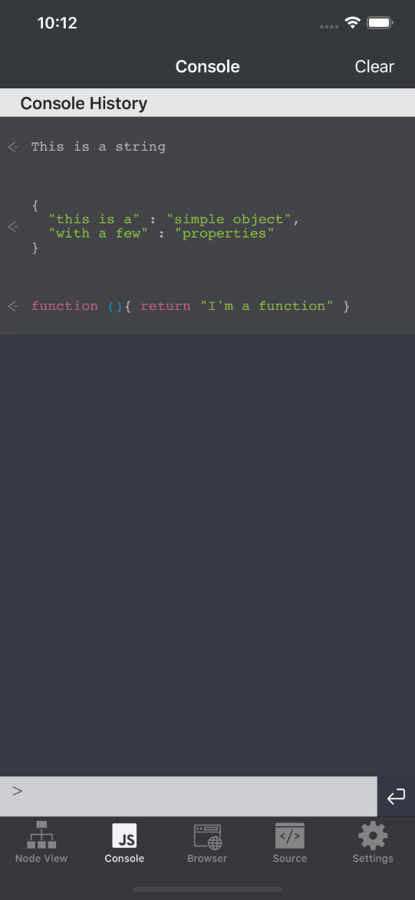
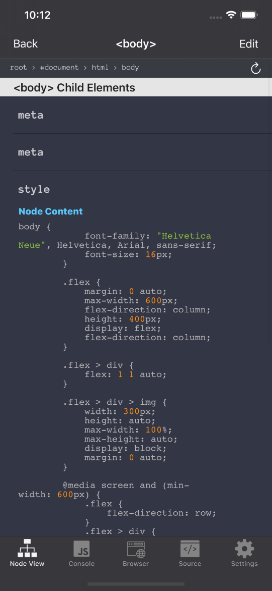
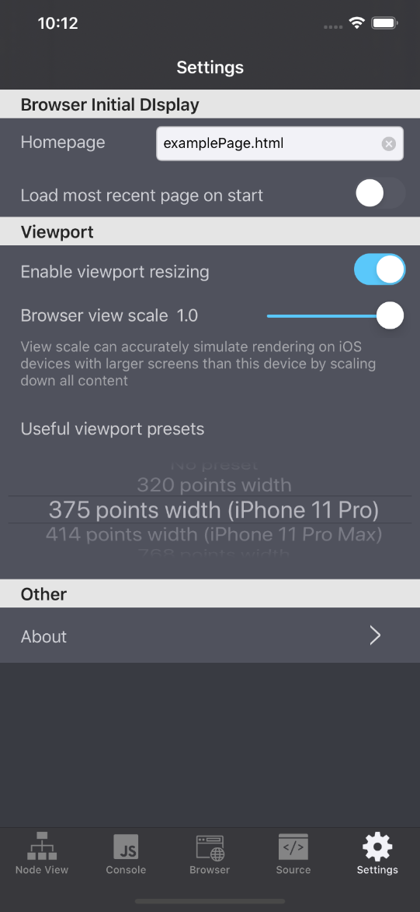

These are my projects outside the "day job". For recent full-time work, see [About](/about)

---

#### Codable
##### Web Developer Tools For Mobile

###### Platform: iOS (iPhone only)

*2022 Update:* I am very happy to see that iOS 15 brings support for [Web Extensions](https://developer.apple.com/documentation/safariservices/safari_web_extensions), meaning that dev tools are now on iOS/iPadOS Safari via other developers' extensions that they have released. I particularly recommend [Web Inspector](https://apps.apple.com/us/app/web-inspector/id1584825745). This does not completely obsolesce Codable (there is still utility in the screen scaling feature) but I'm very happy to see the UX improvements this opens up. Codable is still fully supported, but could use a revamp due to these new iOS APIs.

Codable for iPhone provides these primary features:
- A draggable, resizing viewport with scaling, enabling a webpage to be viewed as if you were on a smaller **or** larger iOS screen size
- Basic JavaScript console support (including catching logs from page as well as entering JS to evaluate)
- Rendered DOM node navigation, with CSS manipulation in a pane once you find the DOM node level you wish to edit
    
Codable heavily uses the [WKWebView.evaluateJavaScipt()](https://developer.apple.com/documentation/webkit/wkwebview/1415017-evaluatejavascript) API to get and set browser console or DOM/source data. The codebase is in Swift, with minimal leverage of third party dependencies.

The desire for this app came about from me using XCode's Simulator to debug and test webpages on various-sized iOS devices (macOS Safari's responsive design mode is *not* always the same), and I thought *this should be possible on an actual iOS device*. There are plenty of iOS tools to view a webpage's source, but very few let you browse the *rendered* source or adjust the viewport size.

Codable is 100% free, ad-free, and tracker-free.

[View Codable on the App Store](http://appstore.com/codable)

###### Screenshots:

---