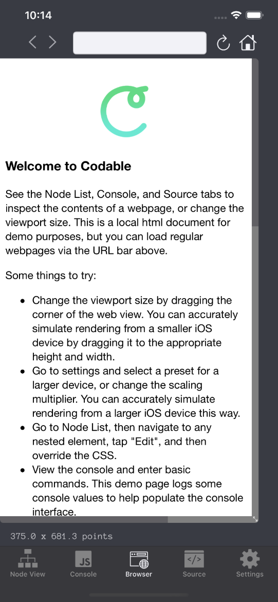
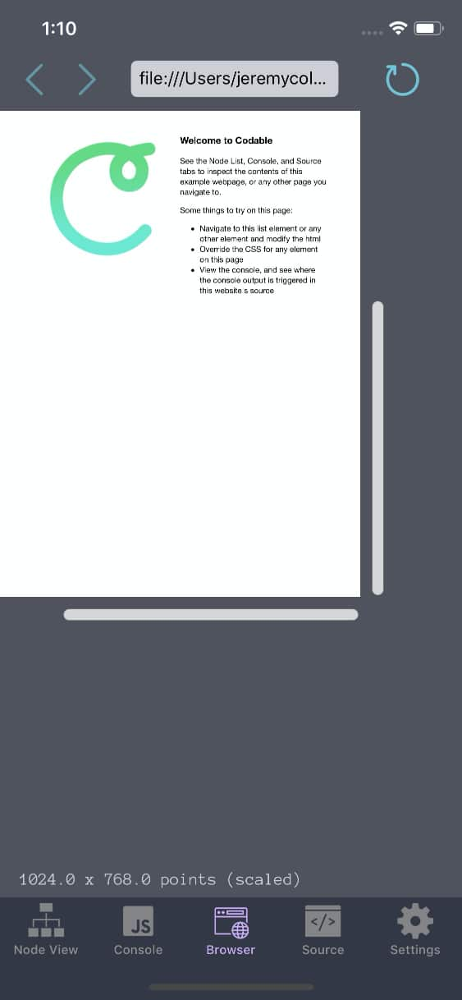

[Codable](http://appstore.com/codable) is now updated, bumped from 1.1.X to 1.5 to represent some substantial improvements.

This little side-project app of mine has now recieved tens of thousands of downloads, and my plan is to keep it up to date, fast, focused, and helpful.

Here's what's changed:

- UI revamp. Now with more "pro" colors, nicer icons, and the browser viewport drag handle system has gotten a re-do
- Improvements to accuracy of manual viewport sizing
- Updates to use the latest version of Swift and iOS 13 optimizations
- Lots of deleted code and dependencies removed  

The (now former) UI I wasn't a huge fan of since I realized it looked a little too "TRON". That's fixed now. Here are the new UI colors and icons (top), compared to before (bottom):

