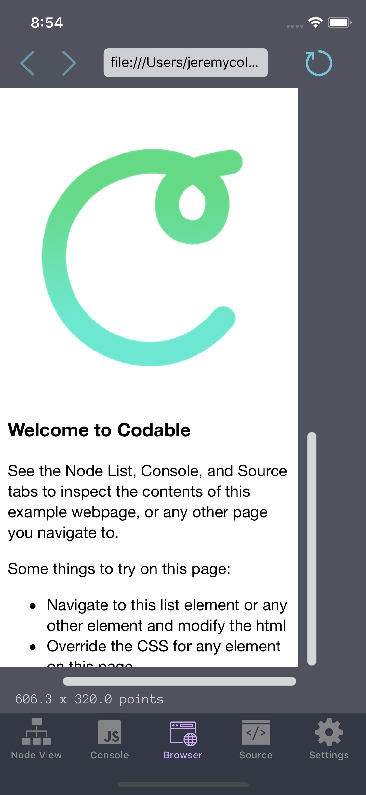

After a few months of evening work and *a lot* of experimentation, I've released an iOS app.

Codable provides three primary features:
- resizable viewport with scaling, allowing you to view any URL as if you were on a smaller **or** larger iOS screen size
- JavaScript console support
- Rendered DOM node navigation and HTML/CSS manipulation

By my knowledge, there are two other functional apps on the iOS app store that do these same functions. It's a pretty niche use-case to want to do front-end web debugging and editing from mobile I know, but it's something *I've* wanted to do many times.

Codable leverages one API endpoint quite heavily and uniquely: [WKWebView.evaluateJavaScipt()](https://developer.apple.com/documentation/webkit/wkwebview/1415017-evaluatejavascript)

If you click through on that link, you'll see that it *isn't too helpful*. There is no APIs for grabbing browser errors, the console, the pre-rendered source, or the rendered DOM. So, how do you grab it? Via JavaScript, from the above API. There is pretty much a constant stream of JS dom-query scripts being applied to the browser, and a JSON-ified node list script response is then captured coming out.

[Go to Codable on the App Store](http://appstore.com/codable)
