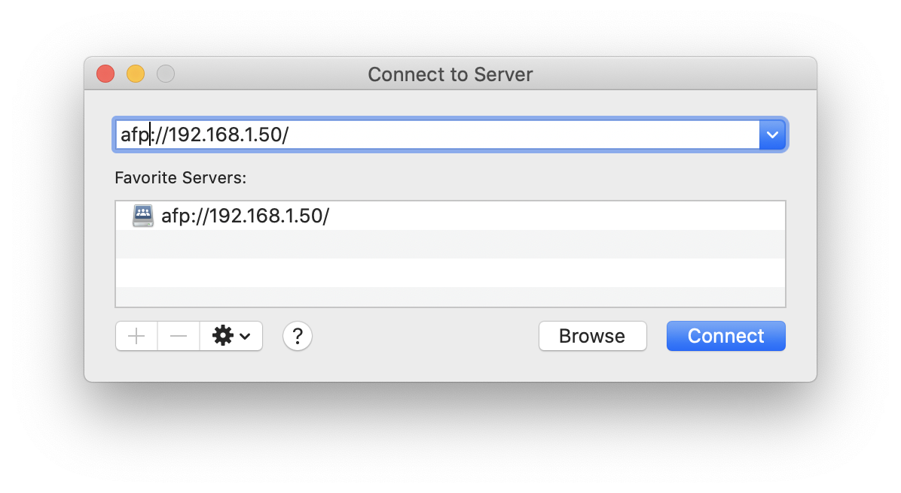
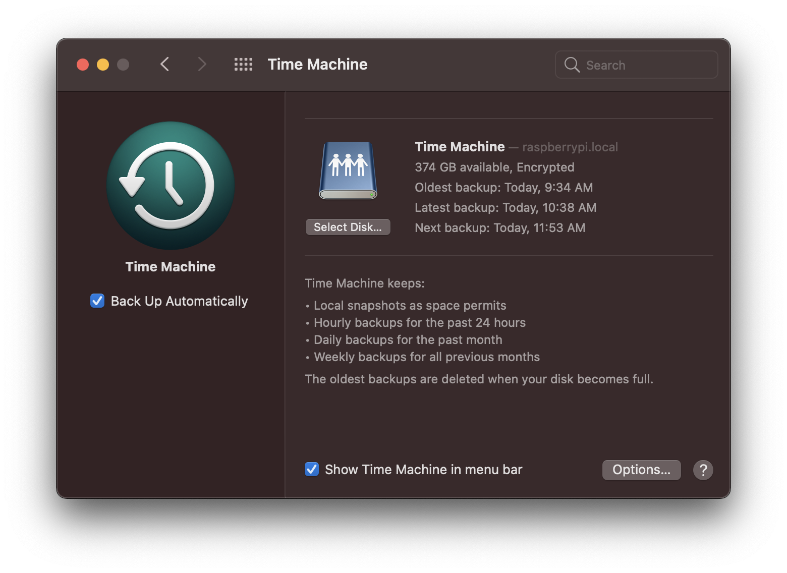

I've now had a few days of reliable, consistent automated Time Machine backups accomplished via my Mac and Rapberry Pi 4B now, attached to a spare 1TB 2.5" USB 3.0 drive. This has persisted across multiple reboots of both the Pi and Mac, so I think it's solid enough to write down for the world. Using the Pi 4B alongside some spare drives can give you a very versatile, cost-effective NAS and server.

Protocols & software used that differentiate this from other guides on this subject:
- ext4 filesystem on Raspberry Pi disk (some other guides have you use HFS+ but I had lots of integrity issues with this `*`)
- AFP to interface with macOS (this is an older protocol but auto-connects reliably for this purpose)

### Steps to set up

Disclaimer: This works on my Mac, running macOS 10.15.4 (Catalina) and Pi 4B running the most up to date default Rapbian OS. This is as of May 2020.

Prerequisites:
- Ensure your Pi is fully up to date `sudo apt-get update && sudo apt-get upgrade -y`
- Make sure the Pi uses a static IP on your local network (there are good guides on this, it is out of scope for this post)

#### Connecting and mounting the drive on the Pi
- Plug in your drive into a USB port on the Pi and get the drive UUID with `ls -lha /dev/disk/by-uuid`. *Make note of the drive reference and UUID* `**`
    - * For the purposes of this guide, my drive reference will be `/dev/sda1` and UUID is `8c9d728a-54f3-4948-81ea-f0482c89fc73`
- Format our drive to ext4 format: `sudo mkfs.ext4 /dev/sda1 -v TimeMachine` **This will destroy all existing data, in case you weren't aware**
    - If you encounter errors or see `/dev/sda` but not `/dev/sda1`, you are missing a proper partition to format most likely. I ran into this and used [Gparted](https://gparted.org/download.php) to repartition the drive
- Next, we want to auto-mount it to a designated folder, so run `sudo nano /etc/fstab`
    - Let's create a directory to mount onto, so `mkdir /mnt/usbtimemachine`. Note: If you don't want to mount onto `/mnt/usbtimemachine` feel free to change this directory name
    - Add this line to the bottom of the file: `UDID=8c9d728a-54f3-4948-81ea-f0482c89fc73 /mnt/usbtimemachine ext4   force,nofail,rw,noauto   0   0`
- Reboot, and now run `df -h` and make sure your drive is present. `sudo fdisk -l` also for a little more verbosity. Make sure everything looks good based on the specs of the drive.

#### Afp and time machine broadcast setup on the Pi
- Install netatalk: `sudo apt-get install netatalk -y`
- edit nsswitch.conf `sudo nano /etc/nsswitch.conf`
    - Line `hosts:          files mdns4_minimal [NOTFOUND=return] dns` becomes `hosts:          files mdns4_minimal [NOTFOUND=return] dns mdns4 mdns`
- edit afp.conf `sudo nano /etc/netatalk/afp.conf`
    - append 

```
[Global]
  mimic model = TimeCapsule6,106

[Time Machine]
  path = /media/pi/TimeMachine
  time machine = yes
```

    - Note that on my system, we are mounting onto `/media/pi/TimeMachine` which you should see on your system if you are user `pi`. If not, your path may be different. This is intentionally not the same path as in the `/etc/fstab` file -- we want to leverage the defaut external media filepath handling of Raspbian here
- Launch services `sudo service avahi-daemon start` and `sudo service netatalk start`

#### Run on Pi boot script
- `sudo crontab -e`
    - append `@reboot sleep 30 && mount /media/tm && sleep 30 && umount /media/tm && sleep 30 && mount /media/tm && sleep 30 && service avahi-daemon start && service netatalk start`

#### Find the Time Machine server on your mac
- Finder > Connect to server
    - Enter `afp://192.168.1.50/` (use the local static IP for your pi instead though)
    - You should be prompted for your pi login info



- Next, go to System Preferences > Time Machine
    - Select Disk > find your Disk
    - You'll be prompted to log in again with your pi user
    - It would be wise to encrypt your backup when macOS asks you here, since it will be plainly readable on the external drive otherwise

And that should do it! The initial connection may take a while. Also try not to interrupt the first complete backup (when I did I had to re-authenticate the drive but after the first successful backup it has reconnected fine after successive mac reboots)




##### Similar guides to try if this fails (this guide is a mashup of these two, with some sprinking of edited commands)
[Gregology's Raspberry Pi Time Machine](https://gregology.net/2018/09/raspberry-pi-time-machine/) -- this guide is most similar to this one, but uses ext4 instead of hfsplus

[Mudge's Using a Raspberry Pi for Time Machine](https://mudge.name/2019/11/12/using-a-raspberry-pi-for-time-machine/) -- uses ext4 and smb as a protocol, and other steps look good but I couldn't get the macOS Time Machine service to find it

##### Footnotes

`*` However ext4 means you cannot plug this drive directly into a mac and must do a network restore if using it to restore your mac. If you don't have a gigabit home network (or 802.11ac WiFi aka WiFi 5), USB 3 drive, and Raspberry Pi 4B (with USB 3), you probably want to just skip this guide.

`**` Note that the Pi provides enough power shared amongst all USB ports to power one 2.5" drive and maybe a keyboard and mouse. If you already have a drive connected and this your second HDD attached to the Pi, I have had good luck with the "Transcend USB 3.0 4-Port Hub TS-HUB3K" hub. Note that the Pi is particular with hubs and you want to find one that won't back-power the Pi itself (we want the Pi using its better USB-C cable for power), and this one appears to not do that. If you don't use a hub, one or both of your drives may suddenly dismount when spun up (or not mount at all).