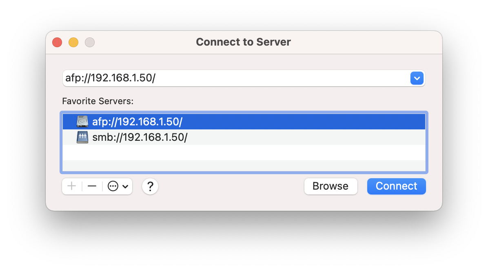
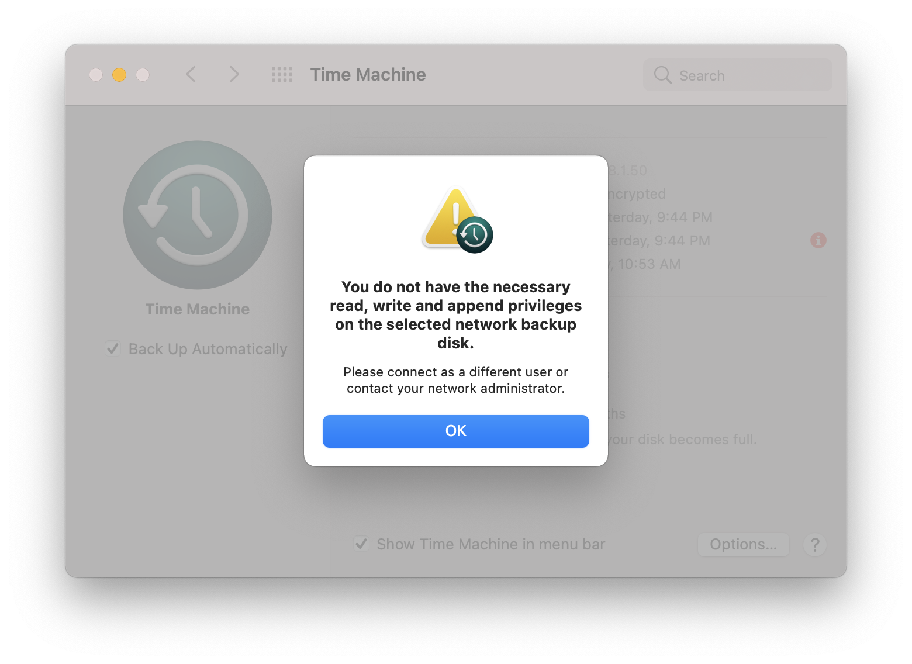

*Update Nov 2021:* Applied changes suggested by Alexis, Johnny, and Joel. Full changes are logged in the git history for this post. Thank you all.

I've now had a few months of reliable, consistent automated Time Machine backups accomplished via my Mac and Rapberry Pi 4B now, attached to a spare 1TB 2.5" USB 3.0 drive. Using the Pi 4B alongside some spare drives can give you a very versatile, cost-effective NAS and server.

### Steps to set up

Prerequisites:
- Ensure your Pi is fully up to date `sudo apt-get update && sudo apt-get upgrade -y`
- Make sure the Pi uses a static IP on your local network (there are good guides on this, it is out of scope for this post)
- Install dependencies: `sudo apt install samba avahi-daemon hfsutils hfsprogs`

#### Connecting and mounting the drive on the Pi
- Plug in your drive into a USB port on the Pi and get the drive UUID with `ls -lha /dev/disk/by-uuid`. *Make note of the drive reference and UUID* 
    - * For the purposes of this guide, my drive reference will be `/dev/sda1` and UUID is `8c9d728a-54f3-4948-81ea-f0482c89fc73`
- Format our drive to HFS+ format: `sudo mkfs.hfs /dev/sda1 -v TimeMachine` or use [Gparted](https://gparted.org/download.php) to repartition the drive and label it `TimeMachine`
- Next, we want to auto-mount it to a designated folder, so run `sudo nano /etc/fstab`
- Add this line to the bottom of the file: `UUID=8c9d728a-54f3-4948-81ea-f0482c89fc73 /media/pi/TimeMachine hfsplus   force,nofail,rw   0   0` (if your username is not `pi`, edit this path to use your nane instead and do the same in subsequent areas)
- Reboot, and now run `df -h` and make sure your drive is present. `sudo fdisk -l` also for a little more verbosity. Make sure everything looks good based on the specs of the drive.

#### Networking from Pi
- Install netatalk: `sudo apt-get install netatalk -y`
- edit nsswitch.conf `sudo nano /etc/nsswitch.conf`
    - Line `hosts:          files mdns4_minimal [NOTFOUND=return] dns` becomes `hosts:          files mdns4_minimal [NOTFOUND=return] dns mdns4 mdns`
- edit smb config: `sudo nano /etc/samba/smb.conf` and append

```
[backups]
    comment = Backups
    path = /media/pi/TimeMachine
    valid users = pi
    read only = no
    vfs objects = catia fruit streams_xattr
    fruit:time machine = yes
```

- edit file: `sudo nano /etc/netatalk/afp.conf`

And append
```
[Global]
  mimic model = TimeCapsule6,106

[Time Machine]
  path = /media/pi/TimeMachine
  time machine = yes
```

- Launch services `sudo service avahi-daemon start` and `sudo service netatalk start`

#### Find the Time Machine server on your mac
- Let's verify the drive is being properly shared. Go to Finder > Connect to server
    - Enter `afp://192.168.1.50/` (use the local static IP for your pi instead though)
    - You should be prompted for your pi login info



- Go to System Preferences > Time Machine
    - Select Disk > find your Disk
    - You'll be prompted to log in again with your pi user
    - It would be wise to encrypt your backup when macOS asks you here, since it will be plainly readable on the external drive otherwise

And that should do it! 


#### Troubleshooting

##### Drive appears read-only

- Set drive permissions (such as `sudo chown -R pi:pi /media/pi/`)
- Alternatively, delete the above mount-point directory (`sudo rmdir /media/pi/TimeMachine`) and reboot (this fixed an issue for me that chmod did not)

##### General drive unreliability
- Ensure above permissions are set, and also verify disk integrity --- `sudo fsck.hfsplus -f /dev/sda1` (or simply re-format)

##### TimeMachine does not find drive
- You can configure the timemachine through the CLI instead 
    * You must first allow terminal full disk access to your mac - see [this guide](https://osxdaily.com/2018/10/09/fix-operation-not-permitted-terminal-error-macos/) for more help
  *  The following command will ask you for both your laptop admin password AND your raspberry pi password
     ```bash
     sudo tmutil setdestination -ap "afp://pi@192.168.1.50/Time Machine" # (use the local static IP for your pi instead though)
     ```

##### Similar guides to try if this fails (this guide is a mashup of these two, with some sprinking of edited commands)
[Gregology's Raspberry Pi Time Machine](https://gregology.net/2018/09/raspberry-pi-time-machine/) -- this guide is most similar to this one, but uses ext4 instead of hfsplus

[Mudge's Using a Raspberry Pi for Time Machine](https://mudge.name/2019/11/12/using-a-raspberry-pi-for-time-machine/) -- uses ext4 and smb as a protocol, and other steps look good but I couldn't get the macOS Time Machine service to find it


