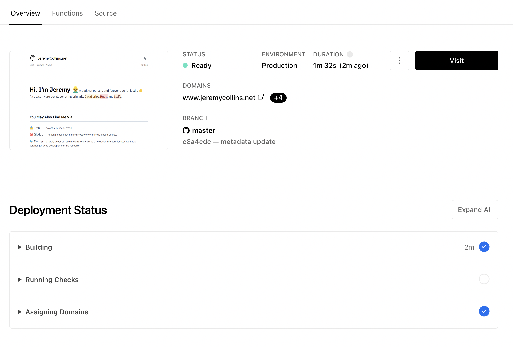

I've switched to deploying with [Vercel](https://vercel.com/dashboard) after doing some dependency updates on this site✧, which is an absolute marvel in terms of UX for deploying code. As long as your site uses one of the stacks it supports, it is seriously amazing. I literally created an account and had my site online within 5 minutes, after spending a few hours debugging Docker and [Traefik](https://github.com/traefik/traefik) settings and realizing it may be time to simplify✧✧.

✧ If you are really curious: [Look at this package.json diff in this commit](https://github.com/jdodsoncollins/JeremyCollinsDotNet/commit/12367b662e6c0c178fbdef30e207ee864d253bea). Yes, this was a little painful but there is so much great frontend tooling out there, it is worth the effort to keep up to date with it! Normally I prioritize major version updates as they come out (within reason) to avoid this sort of big jump.

✧✧ Traefik to be clear was rock-solid and even managed auto-renewing my free SSL certs for years without interruption, but then some config clearly aged out, it needed a revamp, and my Ubuntu DigitalOcean droplet was becoming overkill for this site.