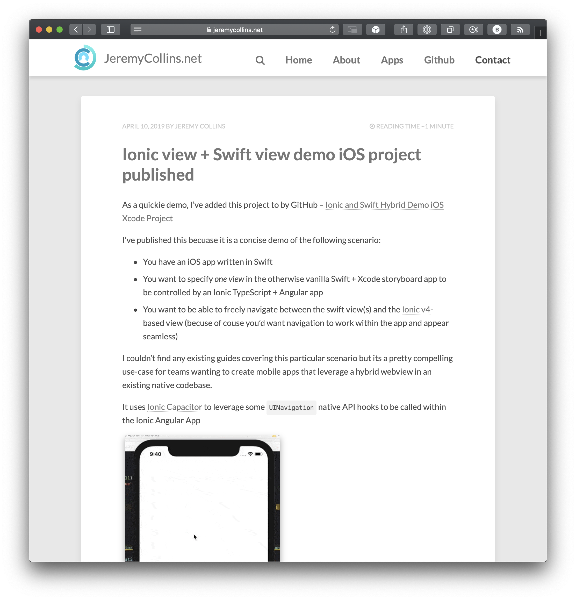

Welcome to JeremyCollins.net version 4.0.

This site is now built with [Gatsby](https://www.gatsbyjs.org/), and extends the theme [Minimal Blog by LekoArts](https://github.com/LekoArts/gatsby-themes/tree/master/themes/gatsby-theme-minimal-blog)

There are posts which pre-date this announcement on here, and that is because JCN 3.0 also happened to use markdown files for blog posts, so each post was almost no effort to move over. I'm not retaining all posts however -- this domain is not meant to be an archive of everything I've ever written (some of which were code snippets or tips that would now be so out of date nobody should read them).

Pre-compiled source and instructions to build this website is on [my public Github project for it](https://github.com/jdodsoncollins/JeremyCollinsDotNet)

Major version history, if anyone is curious: 
* 3.0 was built with Jekyll in 2017. It is visible in the GitHub repo history.
* 2.0 was using Wordpress in 2013 and a custom-made basic theme (this was a web design self-teaching excercise, and I was not a fulltime software develper yet)
* and 1.0 was some static HTML pages in 2011 (To help with the job hunt I figured some basic html/css skills would be helpful)

RIP to this Jekyll theme -- it served me well but I wanted a new overall look & feel (and to switch to JAM stack):

